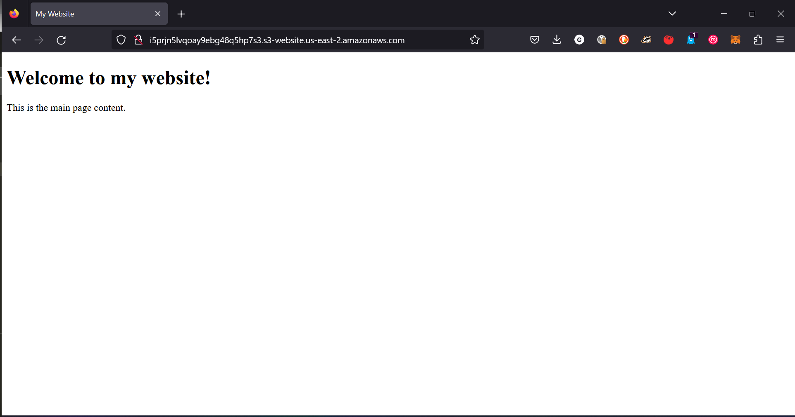
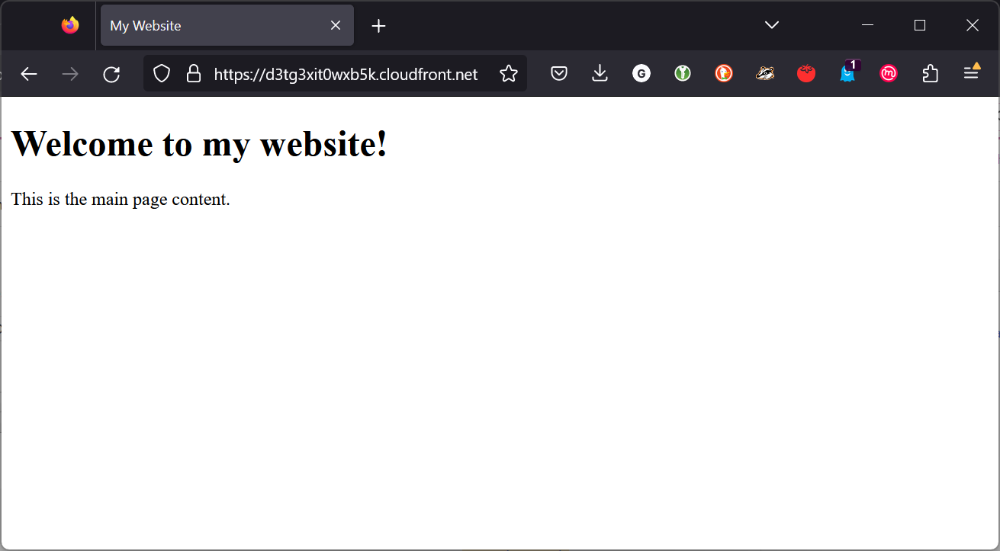
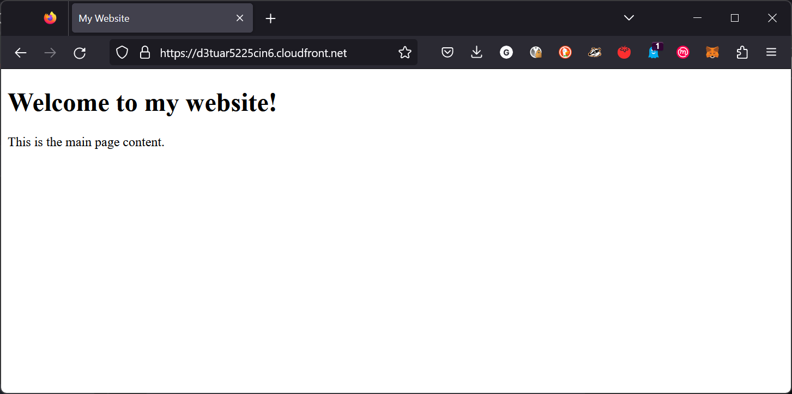
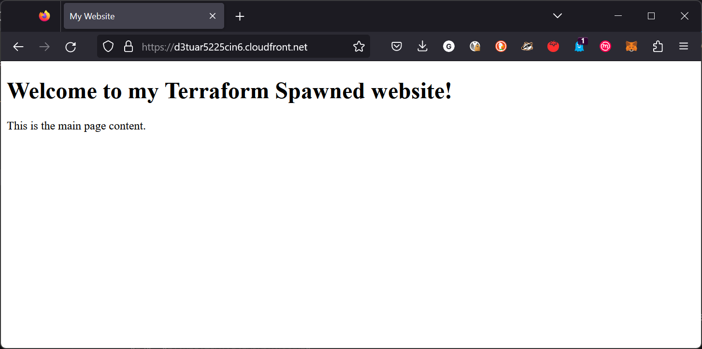
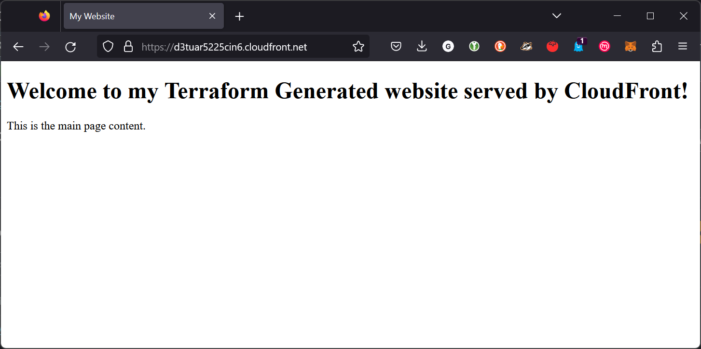

# Terraform Beginner Bootcamp 2023 - week 1

## Standard Module Structure[^1]
```sh
$ tree complete-module/
.
├── README.md
├── main.tf
├── variables.tf
├── outputs.tf
├── ...
├── modules/
│   ├── nestedA/
│   │   ├── README.md
│   │   ├── variables.tf
│   │   ├── main.tf
│   │   ├── outputs.tf
│   ├── nestedB/
│   ├── .../
├── examples/
│   ├── exampleA/
│   │   ├── main.tf
│   ├── exampleB/
│   ├── .../
```

Terraform modules allow you to reuse and share configurations. A Terraform module is a set of Terraform configuration files in a single directory. The standard module structure consists of:

- main.tf - Contains the main Terraform configuration code to create the resources for the module. This may reference other files within the module.

- variables.tf - Defines the input variables that can be passed in to the module. This allows customization of the module.

- outputs.tf - Defines the values that are output from the module. This allows the module to return data to the calling module.

- versions.tf - Constrains the versions of Terraform and providers required by the module. This ensures compatibility. 

- README.md - Provides documentation for using the module. Describes the module, inputs, outputs etc.

- modules/ - Contains any nested modules used by this module.

- examples/ - Provides examples of using the module, including example variables and outputs.

This standard structure makes Terraform modules portable, reusable and maintainable. Modules can encapsulate infrastructure into reusable packages that can be shared and consumed like any other code.

### Terraform and Input Variables

#### -var flag

- This flag allows you to set individual variables via the command line. For example:

`terraform apply -var "instance_type=t2.micro"`

This lets you override a variable value without modifying config files.

#### -var-file flag
- This flag specifies an external variables file for Terraform to load. For example:

`terraform apply -var-file="prod.tfvars"`

This allows you to define reusable groups of variable values.

#### auto.tfvars file

- If this file is present in the current directory, Terraform automatically loads it to populate variables.

auto.tfvars is loaded after terraform.tfvars. It sets default values that can still be overridden.

### Terraform Cloud Variables

Terraform variables and environment variables serve different purposes in Terraform configurations:

Terraform variables (-var, -var-file, .tfvars files) are used to parameterize and customize a Terraform configuration. They allow customizing infrastructure without changing the base Terraform code. Terraform variables are defined and consumed within the Terraform language.

Some examples:

- Defining variable values in terraform.tfvars
- Passing variables via -var flags 
- Setting input variables on modules

Environment variables are used to configure the Terraform CLI behavior and authentication. They are consumed by Terraform itself before running a configuration. 

Some examples:

- TF_LOG - Enables detailed Terraform logging
- AWS_ACCESS_KEY_ID - Sets AWS access key for provider auth
- ARM_CLIENT_SECRET - Authentication for Terraform AzureRM provider

Key differences:

- Terraform vars customize config, env vars configure Terraform CLI 
- Terraform vars defined in TF files, env vars set outside Terraform
- Terraform vars pass data into a config, env vars pass data into Terraform

So in summary, Terraform variables customize configuration while environment variables configure and authenticate the Terraform tool. Both are useful but serve very distinct purposes.

### Loading Terraform Input Variables

- Input variables allow you to parameterize your Terraform configuration. This lets you customize infrastructure without changing code.

- Variables are defined in your Terraform files with variable blocks:
  
```hcl
variable "instance_type" {
  type = string
  default = "t2.micro"
}
```
- Variable types include string, number, boolean, list, map, object, tuple. You can set defaults and mark variables optional/required.

- Simple variables can be passed via the -var command line flag:

`terraform apply -var "instance_type=t2.small"`

- Groups of variables can be defined in .tfvars files like terraform.tfvars. Terraform automatically loads them.

- Modules have input variables defined in variables.tf. You pass values when calling the module.

- Sensitive variables should go in a separate tfvars file that is not committed to source control.

- auto.tfvars can define defaults that are overridable via other variables.

- Unset variables fall back to defaults defined in variable blocks.

- Multiple tfvars files and -var flags can be combined in one command. Later values override earlier ones.

- Environment variables are used for configuring Terraform itself, not passed to your configuration.

Overall, input variables allow full customization of Terraform infrastructure with parameterized configurations.

[Learn more about Inputting variables](https://developer.hashicorp.com/terraform/language/values/variables)

## Addressing Configuration Drift with Terraform Import

Terraform allows importing existing infrastructure into your Terraform state so that it can be managed by Terraform. Here is an overview of how to import infrastructure:

1. Write your Terraform configuration for the infrastructure or resources you want to import. Leave the resource definition empty without any attributes.

2. Run `terraform import` for each resource, specifying the resource address and resource ID:

```
terraform import aws_instance.example i-abcd1234
```


3. Terraform will import the resource and add it to your state file. It will show up in state as "imported".

4. Refresh your state to pull the latest details:

```
terraform refresh
```


5. Populate your Terraform resource configuration with the attributes and details now in your state. You can output resources to see their attributes.

6. Now when you run `terraform plan`, it will show any changes needed to match your configuration rather than wanting to create a new resource. 

7. You can proceed with running `terraform apply` and managing the existing infrastructure going forward.

The key is mapping existing infrastructure to empty resource definitions and importing them before populating the configuration. This allows adopting resources not originally created by Terraform.

### How to Remove Managed Resources Without Destroying Them
Here are a few options to remove a resource from Terraform state without destroying it:

- Execute `terraform state list` to display currently managed resources in the state file
- `terraform taint <resource>` - This marks a resource as tainted, meaning it will be destroyed and recreated on the next apply. You can then prevent the destroy by commenting out the resource config or using `-ignore-tainted` on apply. The resource remains intact outside of Terraform.

- `terraform state rm <resource>` - This removes the resource from the Terraform state entirely. It will no longer be managed by Terraform. Use with caution as it could leave orphaned resources.
  - `terraform state rm -dry-run <resource>`[^2] - Displays that the `<resource>` would be removed from the state file without actually executing the action.

- replace provider with null - Replace the provider for that resource with the null provider. Terraform will no longer perform actions on it.

- `ignore_changes` - Add `ignore_changes` lifecycle rule to ignore all changes to the resource. It will remain in state but unmodified.

- Comment out - Simply comment out the resource config. On next apply it will be removed from state without destroy.

## Terraform Modules

- Terraform modules allow you to encapsulate and reuse infrastructure configurations.

- Modules exist as files in a directory structure. This module directory can be stored and shared. 

- The module source refers to where the module code is loaded from when using a module.

- Modules can be sourced from:

  - Local file paths - ./modules/my-module or ../modules/my-module

  - Terraform Registry - registry.terraform.io/namespace/module

  - GitHub - github.com/username/repo//modules/my-module

  - BitBucket - bitbucket.org/username/repo/modules/my-module

  - HTTP URLs - http://example.com/modules/my-module

- The source is specified in your Terraform code when declaring a module:

```hcl
module "terrahouse_aws" {
  source = "./modules/terrahouse_aws"
}
```

- Terraform will download and cache the module code from the source location.

- Using version tags like 1.0.0 in the source URL pins the module to a specific release.

- Module versions allow upgrading module functionality over time.

- Refer to Terraform [docs](https://developer.hashicorp.com/terraform/tutorials/modules/module-create#create-a-module) for guidance on creating a module

### Installing a Module

- When you run `terraform init`, the module code is downloaded to a `modules/` directory in your working directory.

- Updates to modules are installed by re-running `terraform init` or running `terraform get`.

- Installed modules appear in the Terraform dependency graph. Resources defined in modules look like: `module.vpc.aws_subnet.public`

- Input variables allow customizing and parameterizing modules. Set them within your module block:

```hcl
module "vpc" {
  source = "..."
  
  subnet_counts = {
    public = 2 
    private = 3
  }
}
```

- Outputs from modules can be referenced to pass data to other resources.

Overall, modules allow Terraform configurations to be decomposed and packaged into reusable components that can be published, shared, and installed like any other code dependency.

[Terraform Docs on Module Sources](https://developer.hashicorp.com/terraform/language/modules/sources)


## Setting Up S3 Static Web Hosting
+ [Enable](https://registry.terraform.io/providers/hashicorp/aws/latest/docs/resources/s3_bucket_website_configuration) static website hosting by adding `aws_s3_bucket_website_configuration` block
+ configure **index.html** & **error.html** files
  + execute `mkdir public && touch ./public/index.html ./public/error.html`

```sh
# Insert HTML code into index.html
cat <<EOF > ./public/index.html
<!DOCTYPE html>
<html>
<head>
  <title>My Website</title>
</head>
<body>

  <h1>Welcome to my website!</h1>
  
  <p>This is my main page content.</p>
  
</body>
</html>
EOF
```

### Working with Files in Terraform

#### Path Variable

Here is a summary of using Terraform's path functions to manipulate file paths:

- The path functions allow transforming and extracting parts of filesystem paths in Terraform.

- `path.module` returns the filesystem path of the module where the expression is called. Useful for locating files relative to a module.

- `path.root` returns the filesystem path of the root module. Helpful for referencing files relative to the root.

- `path.cwd` returns the current working directory where Terraform was run. Can create paths relative to cwd.

- `path.basename` extracts just the filename from a path. Removes directories.

- `path.dirname` extracts the directory portion of a path without the filename.

- `path.ext` extracts the file extension from a path.

- `path.join` concatenates path segments into a single path. Prevents OS-specific issues.

Example usages:

```
path.module   -> /terraform/modules/vpc
path.root     -> /terraform/modules 
path.basename(/terraform/modules/vpc/main.tf) -> main.tf
path.ext(/terraform/modules/vpc.zip) -> .zip
path.join("data", "users.csv") -> data/users.csv
```

Overall, path functions are useful for working with filesystem paths in a portable way. They help locate, parse, and manipulate paths in Terraform code.

## S3 Static Web Hosting continued

+ Setting permissions for website access
  + Step 1: Edit S3 Block Public Access settings by adding `aws_s3_bucket_public_access_block` block, learn more [here](https://registry.terraform.io/providers/hashicorp/aws/latest/docs/resources/s3_bucket_public_access_block)
  + Step 2: Add a bucket policy, `aws_s3_bucket_policy`
    + Use a bucket policy to grant public read permission to your objects. However, the bucket policy applies only to objects that are owned by the bucket owner. If your bucket contains objects that aren't owned by the bucket owner, the bucket owner should use the object access control list (ACL) to grant public READ permission on those objects. [^3]
  
When the code is correctly implemented, the url for the site will be outputted.



## Implementing CloudFront Distribution
+ [AWS CloudFront Distribution](https://registry.terraform.io/providers/hashicorp/aws/latest/docs/resources/cloudfront_distribution)
+ [CloudFront Origin Access Control, which is used by CloudFront Distributions with an Amazon S3 bucket as the origin.](https://registry.terraform.io/providers/hashicorp/aws/latest/docs/resources/cloudfront_origin_access_control)

### Terraform Locals
- Locals allow defining named values that can be used multiple times within a module or configuration. 

- They are like variables, but cannot be changed externally. Locals are fixed values within the module.

- Locals are defined in a locals block:

```hcl
locals {
  service_name = "forum"
  owner        = "Community Team"
}
```

- Local values can help reduce repetition:

```hcl
locals {
  common_tags = {
    Service = local.service_name
    Owner   = local.owner
  }
}
```

- Local values are accessed via the local namespace: 

```hcl
resource "aws_instance" "example" {
  tags = local.common_tags
}
```

- Locals can only be defined once per module. Subsequent definitions will merge with previous.

- Local values are calculated only when referenced to avoid unnecessary processing.

- Local names should be unique within a module.

Overall, locals allow encapsulating reusable values and prevent duplication in Terraform configurations. They provide readability and maintainability.

### Data Sources
- Data sources allow accessing information about existing infrastructure resources.

- They are defined like resources, but start with the data keyword:

```hcl
data "aws_ami" "ubuntu" {
  filter {
    name = "ubuntu/images/*ubuntu-xenial-16.04-amd64-server-*"
  }
}
```

- Data source values can be referenced like regular resources: 

`data.aws_ami.ubuntu.id`

- Data sources don't create or modify infrastructure, they just query and return data.

- Common uses:
  - Look up IDs, attributes of resources (AMIs, VPCS etc).
  - Reference information defined outside Terraform.
  - Import existing infrastructure into Terraform state.

- Data sources can access info from various providers - AWS, GCP, Kubernetes etc.

- The data is only refreshed when the data block is queried, not on every run.

Overall, data sources allow dynamically querying external state rather than hardcoding values. This provides flexibility to access information about existing resources.

### filemd5 & etag function
The filemd5 and etag functions in Terraform are useful for creating unique identifiers and performing cache invalidation when file contents change.

filemd5 calculates an md5 hash of the contents of a file. For example:

```
filemd5("${path.module}/config.txt")
```

This generates a unique md5 checksum based on the contents of the file. If the file changes, the md5 hash will be different.

etag generates a unique identifier based on one or more values. For example:

``` 
etag(filemd5("${path.module}/config.txt"))
```

This creates an etag value calculated from the md5 hash of the file.

Uses cases:

- Generate unique IDs for infrastructure based on file contents.
- Trigger updates/redeploys when tracked files are modified.
- Implement caching and invalidation when source files change.

For example, you can attach the etag value to a deployment resource. When the source file changes, the etag changes, forcing a redeploy.

The filemd5 and etag functions allow implementing changes to infrastructure based on modifications to important files. This enables tracking changes and forcing updates.

### jsonencode Function
- jsonencode converts a Terraform expression result into a string containing the JSON representation.

- It is useful for formatting strings in JSON syntax, especially for passing to API calls.

- Simple example:

```hcl
jsonencode(["a", "b", "c"])

// ["a", "b", "c"]
```

- Works for maps:

```hcl
jsonencode({
  name = "John"
  age  = 30
})

// {"name": "John", "age": 30}
```

- And objects:

```hcl
jsonencode({
  user = {
    name = "John"
    age  = 30  
  }
})

// {"user": {"name": "John", "age": 30}}
```

- Automatically escapes special characters.

- Nested structures become nested JSON.

- Keys in objects are converted to strings.

- Useful for passing Terraform values as JSON parameters in API calls, user data scripts etc.

- More readable than trying to format JSON strings manually.

Overall, jsonencode makes it easy to convert Terraform values into JSON-formatted strings when needed.

## Implementing CloudFront continued
+ set content type of `aws_s3_object` for **index.html** & **error.html**, so CF will serve document instead of download it when accessing CF url
  
+ Here is an explanation of how CloudFront recaches new files uploaded to an S3 origin:

  - By default, CloudFront will only recache an object from the origin if it is already in the edge cache and the file is overwritten in S3.

  - When an existing file is updated in S3, CloudFront gets an HTTP 304 Not Modified response indicating the file was changed. This triggers recaching.

  - However, for new files uploaded to S3 that are not already cached in CloudFront, no 304 status is returned.

  - To get CloudFront to recache new objects:

    - You can invalidate the object explicitly using the CloudFront API or AWS CLI. This recaches immediately.
      - Here is an example aws cli command to invalidate files in a CloudFront distribution:

      ```bash
      aws cloudfront create-invalidation \
        --distribution-id EXAMPLE_DIST_ID \
        --paths /index.html /images/logo.png
      ```

      This will invalidate the files `/index.html` and `/images/logo.png` in the CloudFront distribution with ID `EXAMPLE_DIST_ID`.

      Some notes:

      - The `--distribution-id` option specifies the target distribution ID.

      - `--paths` lists the paths of files you want to invalidate.

      - Paths should include leading slash and no domain.

      - Up to 3000 paths can be invalidated in a single call.

      - Invalidation sends a request to CloudFront to fetch new files from the origin.

      - Invalidation status can be checked with `aws cloudfront get-invalidation`.

      - Alternative is to invalidate by */* to purge entire cache.

      This provides a way to programmatically invalidate files and force CloudFront to refresh objects from the origin. Useful after uploading new versions of files.

    - Use versioned S3 objects. Uploading a new object version triggers recaching.

    - Set a Cache-Control max-age=0 header when uploading. This forces CloudFront to revalidate on next fetch.

    - Use the s3:ObjectCreated:* event to trigger a Lambda@Edge function to invalidate the new object.

  - You can also set a CloudFront default TTL of 0 to force all objects to be requeried from the origin frequently. But this impacts performance.

+ So in summary, new files require extra steps to trigger immediate recaching compared to updating existing cached files. But options exist to force CloudFront to fetch new objects.

When to CloudFront is configured correctly, the index.html will be served.



## Set up Content Version of files
Content versioning of files can be implemented so that the lifecycle of resources can be triggered explicitly.

### Resource Lifecycle
- The lifecycle block defines lifecycle rules for a resource like create, destroy and ignore behaviors.

- Common lifecycle settings:

  - create_before_destroy - Create new resource before destroying old to avoid downtime.

  - prevent_destroy - Prevents accidental delete of resource.

  - ignore_changes - Ignore certain attributes when planning updates to prevent forced resource recreation.

- Example lifecycle config:

```hcl
resource "aws_instance" "server" {

  # ...
  
  lifecycle {
    create_before_destroy = true
    prevent_destroy       = true

    ignore_changes = [
      ami, # Ignore AMI changes
    ]
  }
}
```

- create_before_destroy provisions a new updated instance before deleting old instance.

- prevent_destroy stops instance from being deleted.

- ignore_changes avoids rebuilding instance if just the AMI changes.

- Lifecycle rules depend on the resource type and provider.

Overall, lifecycle metadata provides control over the lifecycle of resources to prevent unwanted destruction or changes. This provides stability and customization of management workflows.

[Resource Lifecycle](https://developer.hashicorp.com/terraform/tutorials/state/resource-lifecycle)
[more resource lifecycle](https://developer.hashicorp.com/terraform/langauge/meta-arguments/lifecycle)

### Terraform Data Resource
Terraform's []`terraform_data`](https://developer.hashicorp.com/terraform/language/resources/terraform-data#example-usage-data-for-replace_triggered_by) resource is a powerful feature that allows users to retrieve and manipulate data from external sources, making it a versatile tool for managing infrastructure as code. Here's a summary of how to use the `terraform_data` resource:

1. **Data Sources**: Terraform's `terraform_data` resource is designed to fetch data from various external sources, such as AWS, Azure, Google Cloud, or any custom provider that Terraform supports.

2. **Declaration**: To use `terraform_data`, you declare it in your Terraform configuration file (typically a `.tf` file). You specify the data source type and provide any required or optional configuration parameters. For example, if you want to fetch AWS information, you would declare an `aws_ami` data source.

3. **Data Retrieval**: After declaring the data source, you can use Terraform to fetch data from the specified external source. Terraform queries the source based on the configuration parameters you provided.

4. **Immutable Data**: The data fetched via `terraform_data` is treated as immutable, meaning it cannot be modified or updated. It's a read-only operation used for referencing information from external sources.

5. **Dependency Management**: Terraform automatically manages the dependencies between resources and data sources. When you declare a resource that depends on data retrieved via `terraform_data`, Terraform ensures that the data is fetched before provisioning the resource.

6. **Output Usage**: You can use the data retrieved from `terraform_data` in various ways. Common use cases include using this data to configure resources, set variables, or generate dynamic values for your infrastructure.

7. **Data Refresh**: Terraform allows you to refresh the data from external sources by running the `terraform refresh` command. This can be useful if you want to update the information without making changes to your infrastructure.

```hcl
variable "revision" {
  default = 1
}

resource "terraform_data" "replacement" {
  input = var.revision
}

# This resource has no convenient attribute which forces replacement,
# but can now be replaced by any change to the revision variable value.
resource "example_database" "test" {
  lifecycle {
    replace_triggered_by = [terraform_data.replacement]
  }
}
```

In summary, Terraform's `terraform_data` resource is a crucial component for fetching and utilizing external data within your infrastructure as code. It provides a reliable and efficient way to incorporate information from external sources into your Terraform configurations, helping you create more dynamic and flexible infrastructure deployments.




## Implement Trigger for Invalidating CloudFront Cache

### Local-exec Provisioner
The `local-exec` provisioner in Terraform is a powerful tool that allows you to execute arbitrary local commands on the machine running the Terraform configuration. Here's a summary of its usage:

1. **Provisioning Local Resources**: The `local-exec` provisioner is often used for tasks that can't be handled by Terraform's native resources or data sources, such as running scripts, installing software, or configuring local settings on the host machine.

2. **Resource-Level Provisioning**: You can attach the `local-exec` provisioner to various Terraform resource types (e.g., AWS instances, Azure virtual machines) to execute commands after the resource is created or updated. This enables you to perform post-deployment actions on the target resource.

3. **Customization and Automation**: With the `local-exec` provisioner, you can automate complex configuration tasks by running shell commands or scripts. This can include tasks like initializing a database, setting up network configurations, or installing software dependencies.

4. **Interpolation**: You can use Terraform variable interpolation to pass information about the resource being provisioned into your `local-exec` provisioner commands. This allows you to dynamically generate and execute commands based on the resource's attributes.

5. **Output Handling**: The `local-exec` provisioner can capture and use output values from the executed commands. This is useful for scenarios where you need information generated by the local command to configure other parts of your infrastructure.

6. **Caution and Security**: Care should be taken when using `local-exec` since it executes commands on the machine running Terraform. Ensure that the commands are safe and do not expose sensitive information. Always follow best practices for security and avoid hardcoding credentials.

7. **Idempotence**: While Terraform itself maintains idempotence for resource management, the commands executed by `local-exec` may not be idempotent by default. It's essential to design your commands or scripts to handle idempotence when using this provisioner.

In summary, the `local-exec` provisioner in Terraform is a versatile tool that allows you to automate and customize infrastructure provisioning by running local commands or scripts. It can be a valuable addition to your Terraform configurations, especially when dealing with tasks that cannot be achieved through Terraform's built-in resources and data sources. However, it should be used with caution to ensure security and reliability in your infrastructure deployments.

Using the `local-exec` provisioner in Terraform to change the configuration of resources is not the preferred or recommended way to manage infrastructure changes. The primary purpose of the `local-exec` provisioner is to run arbitrary local commands or scripts on the machine where Terraform is executed, typically for tasks that cannot be managed directly through Terraform's resource configurations.

Here are a few reasons why it's not preferred for changing the configuration of resources:

1. **Terraform Declarative Approach**: Terraform follows a declarative approach, where you specify the desired state of your infrastructure in code, and Terraform manages the changes to achieve that state. Using `local-exec` for resource configuration changes can lead to an imperative approach, which is less predictable and harder to manage.

2. **Idempotence**: Terraform resources are designed to be idempotent, meaning they can be safely applied multiple times without unintended side effects. Commands executed through `local-exec` might not be idempotent, which can result in unexpected behavior and difficulties in maintaining the desired infrastructure state.

3. **Limited Portability**: Using `local-exec` ties your Terraform configuration to the specific environment where it's executed. It may not work consistently across different systems or in collaborative projects with multiple contributors.

4. **Security Risks**: Executing arbitrary local commands can pose security risks, especially if the commands involve sensitive information or untrusted scripts. Proper security measures should be in place to mitigate these risks.

Instead of relying on `local-exec` to change the configuration of resources, consider these alternatives:

1. **Use Terraform Resource Configuration**: Whenever possible, define the desired state of your resources directly within Terraform resource configurations. Terraform is designed to manage resource changes efficiently and consistently.

2. **Utilize Terraform Data and Variables**: Leverage Terraform data sources and variables to dynamically configure your resources based on inputs or data fetched from external sources.

3. **Terraform Modules**: Organize your infrastructure code into reusable Terraform modules. Modules encapsulate resource configurations and can be parameterized to support various configurations, making them a more structured way to manage resource changes.

4. **Remote Exec Provisioner**: If you need to run remote commands on provisioned resources, consider using Terraform's `remote-exec` provisioner, which is designed for this purpose and can be combined with resource definitions.

In summary, while the `local-exec` provisioner can be useful for specific tasks, it is not the preferred approach for changing the configuration of resources in Terraform. It's generally advisable to follow Terraform's declarative model and use its resource configurations, modules, and data sources to define and manage infrastructure changes in a structured and idempotent manner.



## References
[^1]: [Learn more about Standard Module Structure](https://developer.hashicorp.com/terraform/language/modules/develop/structure)
[^2]: [Documentation on `terraform state rm` command](https://developer.hashicorp.com/terraform/cli/commands/state/rm)
[^3]: [Object access control lists](https://docs.aws.amazon.com/AmazonS3/latest/userguide/WebsiteAccessPermissionsReqd.html#object-acl)
