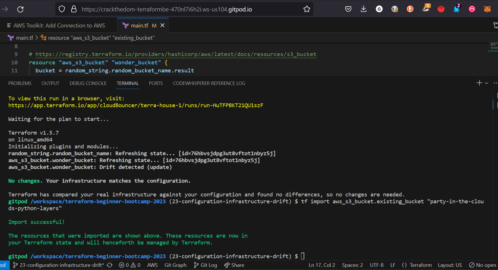

# Terraform Beginner Bootcamp 2023 - week 1

## Standard Module Structure[^1]
```sh
$ tree complete-module/
.
├── README.md
├── main.tf
├── variables.tf
├── outputs.tf
├── ...
├── modules/
│   ├── nestedA/
│   │   ├── README.md
│   │   ├── variables.tf
│   │   ├── main.tf
│   │   ├── outputs.tf
│   ├── nestedB/
│   ├── .../
├── examples/
│   ├── exampleA/
│   │   ├── main.tf
│   ├── exampleB/
│   ├── .../
```

Terraform modules allow you to reuse and share configurations. A Terraform module is a set of Terraform configuration files in a single directory. The standard module structure consists of:

- main.tf - Contains the main Terraform configuration code to create the resources for the module. This may reference other files within the module.

- variables.tf - Defines the input variables that can be passed in to the module. This allows customization of the module.

- outputs.tf - Defines the values that are output from the module. This allows the module to return data to the calling module.

- versions.tf - Constrains the versions of Terraform and providers required by the module. This ensures compatibility. 

- README.md - Provides documentation for using the module. Describes the module, inputs, outputs etc.

- modules/ - Contains any nested modules used by this module.

- examples/ - Provides examples of using the module, including example variables and outputs.

This standard structure makes Terraform modules portable, reusable and maintainable. Modules can encapsulate infrastructure into reusable packages that can be shared and consumed like any other code.

### Terraform and Input Variables

#### -var flag

- This flag allows you to set individual variables via the command line. For example:

`terraform apply -var "instance_type=t2.micro"`

This lets you override a variable value without modifying config files.

#### -var-file flag
- This flag specifies an external variables file for Terraform to load. For example:

`terraform apply -var-file="prod.tfvars"`

This allows you to define reusable groups of variable values.

#### auto.tfvars file

- If this file is present in the current directory, Terraform automatically loads it to populate variables.

auto.tfvars is loaded after terraform.tfvars. It sets default values that can still be overridden.

### Terraform Cloud Variables

Terraform variables and environment variables serve different purposes in Terraform configurations:

Terraform variables (-var, -var-file, .tfvars files) are used to parameterize and customize a Terraform configuration. They allow customizing infrastructure without changing the base Terraform code. Terraform variables are defined and consumed within the Terraform language.

Some examples:

- Defining variable values in terraform.tfvars
- Passing variables via -var flags 
- Setting input variables on modules

Environment variables are used to configure the Terraform CLI behavior and authentication. They are consumed by Terraform itself before running a configuration. 

Some examples:

- TF_LOG - Enables detailed Terraform logging
- AWS_ACCESS_KEY_ID - Sets AWS access key for provider auth
- ARM_CLIENT_SECRET - Authentication for Terraform AzureRM provider

Key differences:

- Terraform vars customize config, env vars configure Terraform CLI 
- Terraform vars defined in TF files, env vars set outside Terraform
- Terraform vars pass data into a config, env vars pass data into Terraform

So in summary, Terraform variables customize configuration while environment variables configure and authenticate the Terraform tool. Both are useful but serve very distinct purposes.

### Loading Terraform Input Variables

- Input variables allow you to parameterize your Terraform configuration. This lets you customize infrastructure without changing code.

- Variables are defined in your Terraform files with variable blocks:
  
```terraform
variable "instance_type" {
  type = string
  default = "t2.micro"
}
```
- Variable types include string, number, boolean, list, map, object, tuple. You can set defaults and mark variables optional/required.

- Simple variables can be passed via the -var command line flag:

`terraform apply -var "instance_type=t2.small"`

- Groups of variables can be defined in .tfvars files like terraform.tfvars. Terraform automatically loads them.

- Modules have input variables defined in variables.tf. You pass values when calling the module.

- Sensitive variables should go in a separate tfvars file that is not committed to source control.

- auto.tfvars can define defaults that are overridable via other variables.

- Unset variables fall back to defaults defined in variable blocks.

- Multiple tfvars files and -var flags can be combined in one command. Later values override earlier ones.

- Environment variables are used for configuring Terraform itself, not passed to your configuration.

Overall, input variables allow full customization of Terraform infrastructure with parameterized configurations.

[Learn more about Inputting variables](https://developer.hashicorp.com/terraform/language/values/variables)

## Addressing Configuration Drift with Terraform Import

Terraform allows importing existing infrastructure into your Terraform state so that it can be managed by Terraform. Here is an overview of how to import infrastructure:

1. Write your Terraform configuration for the infrastructure or resources you want to import. Leave the resource definition empty without any attributes.

2. Run `terraform import` for each resource, specifying the resource address and resource ID:

```
terraform import aws_instance.example i-abcd1234
```


3. Terraform will import the resource and add it to your state file. It will show up in state as "imported".

4. Refresh your state to pull the latest details:

```
terraform refresh
```


5. Populate your Terraform resource configuration with the attributes and details now in your state. You can output resources to see their attributes.

6. Now when you run `terraform plan`, it will show any changes needed to match your configuration rather than wanting to create a new resource. 

7. You can proceed with running `terraform apply` and managing the existing infrastructure going forward.

The key is mapping existing infrastructure to empty resource definitions and importing them before populating the configuration. This allows adopting resources not originally created by Terraform.

[^1]: [Learn more about Standard Module Structure](https://developer.hashicorp.com/terraform/language/modules/develop/structure)
